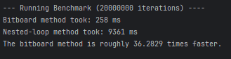

# Connect 4

| contents                                         |
|--------------------------------------------------|
| [Description](#description)                      |
| [Benchmark Results](#benchmark-results)          |
| [Setup/Installation](#setupinstallation-process) |
| [License](#license)                              |
| [Contributing](#contributing)                    |

## Description
This connect 4 game has been made using bitboard. Connect 4 is a simple game where you have 2 players and both players try to get 4 pieces in a row. Due to their being 2 players this meant
that the game would require 2 bitboards. One for each player. Bitboards are a data structure where it represents a game's
board state in a single integer. This bitboard implementation results in a `~97%` performance improvement in win detection compared
to a traditional loop-based approach.

For this version of the game the bitboards are initialised using `unsigned long long int`. This provides 64 bits to represent
the game states which more than enough since connect 4 has 42 playable squares. Due to bitboards, the win checking time complexity is O(1) (constant time), a significant improvement over the O(n) complexity of a traditional loop-based search.
The checks are mainly done by multiple bitwise shifts and `&` operator.

This connect 4 uses a padded bitboard where an extra row was introduced which acts like a buffer that prevents errors when performing
checks near the edge. This was done to allow for simpler and faster code.<br>
Using this padding row the following win condition checks were made:
```
vertical check = >> 1
horizontal check = >> 7
diagonal right check = >> 8 
diagonal left check = >> 6 
```
This padding row meant that no specific masks had to be introduced but also, there isn't a chain of specific if statements.


## Benchmark Results
The data below clearly shows the significant performance advantage of the bitboard implementation.<br>


This dramatic speed increase is due to the bitboards ability to leverage bit-level parallelism. A single bitwise operation
(like a shift `>>` or an AND `&`) can evaluate multiple board positions simultaneously. In contrast, the nested-loop approach
must check every potential four in a row sequentially, leading to hundreds of individual comparisons and memory accesses. This benchmark 
is a practical demonstration of how choosing an efficient algorithm can lead to orders of magnitude improvements in software performance.

## Setup/Installation Process

### Prerequisites
You will need a C++ compiler, such as g++. If you are on a Debian-based Linux distribution (like Ubuntu), you can install it with:
```
sudo apt update && sudo apt install g++
```


1. **Clone the repository**

First, download the source code from GitHub.
```
git clone [https://github.com/YourUsername/YourProjectName.git](https://github.com/YourUsername/YourProjectName.git)
cd YourProjectName
```

2. **Compile the code**

Compile the source code using a single g++ command. The -O2 flag enables optimizations, which is important for performance.
```
g++ -O2 main.cpp -o Connect4InC++
```

3. Running the Game

If the build process completed without errors, the executable is now located inside the `build` folder. To run it, use the following command:

```
./Connect4InC++
```

The game should now start in your terminal. Enjoy!

## Contributing

1. Fork the repo.
2. git checkout -b feature/idea
3. Make changes + commit: git commit -am "Add idea"
4. Push: git push origin feature/idea


## License
MIT. See [LICENSE](license.md)